<!-- ============ Bloom Header (live weather · day / night follows your theme) ============ -->

  <picture>
    <source media="(prefers-color-scheme: dark)" srcset="bloom-header-night.svg" />
    
  </picture>

  <b>Data Science &amp; Big Data Student</b> · Brain–Computer Interfaces &amp; Drone Swarms · AI Agent Builder
   
  🏆 2025 HarmonyOS Developer Incentive Program &nbsp;·&nbsp; 📜 3 Software Copyrights

 

<!-- ============ Tech Garden ============ -->

      
 
      
 
      
 
     
 
     

🌱 &nbsp;<b>Field guide</b> — open to read what every chip actually is

 

 
 
 
 
 

 

<!-- ============ Featured Projects ============ -->

### 🌿 Featured work

 

 

 

<!-- ============ Stats ============ -->

<picture>
  <source media="(prefers-color-scheme: dark)" srcset="streak-night.svg" />
  
</picture>

 

<!-- ============ Snake ============ -->

  <picture>
    <source media="(prefers-color-scheme: dark)" srcset="https://raw.githubusercontent.com/lzynb0206/lzynb0206/output/github-contribution-grid-snake-dark.svg" />
    
  </picture>

<!-- ============ Footer (a cat lives here) ============ -->

  <picture>
    <source media="(prefers-color-scheme: dark)" srcset="garden-footer-night.svg" />
    
  </picture>

Data Science &amp; Big Data student exploring brain–computer interfaces, EEG-driven drone systems, Java AI agents, and native HarmonyOS applications. The sky follows the Beijing forecast and the garden follows the season.

